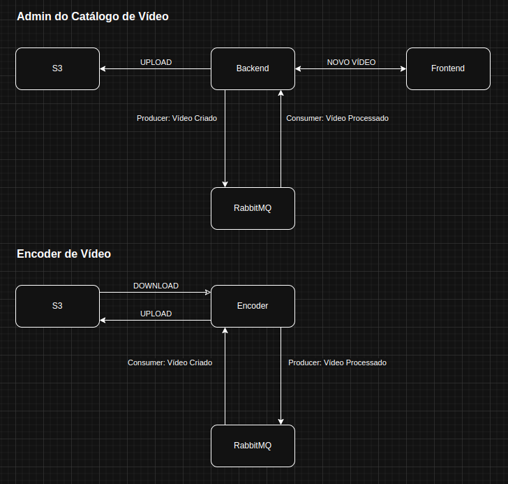
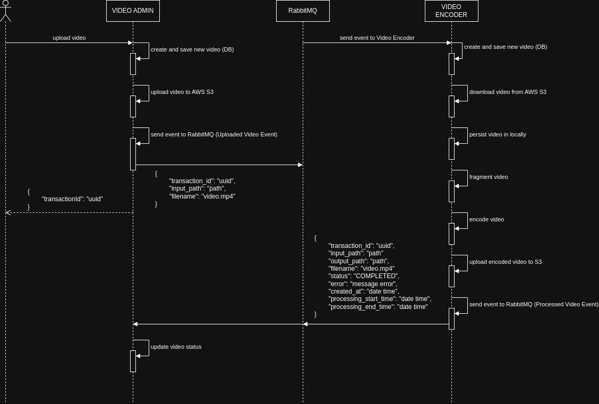

# Flixtube Project

## Microservices

### Video Admin

The **Video Admin** service is responsible for orchestrating the video upload and
management workflow within the platform. Its main responsibilities include:

- Receiving videos uploaded by user admin
- Storing the videos
- Uploading the videos to an AWS S3 bucket
- Communicating with the **Video Encoder** microservice through a RabbitMQ queue, sending the necessary information for video processing
- Receiving notifications from the Video Encoder (also via RabbitMQ) once the processing in complete
- Updating the video status in its database based on the response received from the **Video Encoder** service

### Video Encoder

The **Video Encoder** service is responsible for:

- Receiving messages from the RabbitMQ queue with information about the videos to be processed
- Downloading the corresponding video from AWS S3 bucket
- Performing the video encoding process
- Uploading the processed video to an AWS S3 bucket
- Notifying the **Video Admin** service via RabbitMQ once the processing is complete, indicating whether it succeeded or failed

## Tech Design

### Flow diagram

